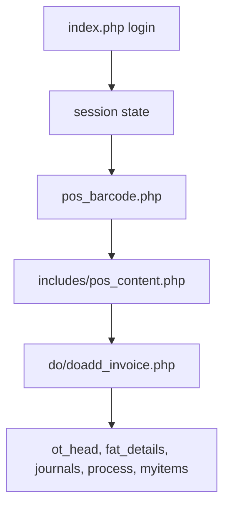
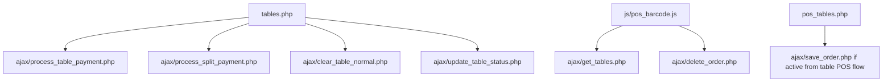
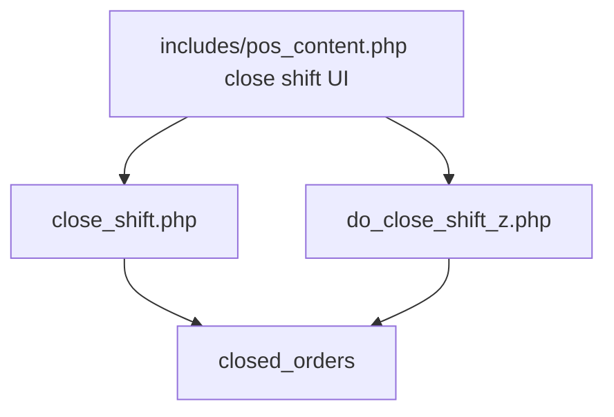
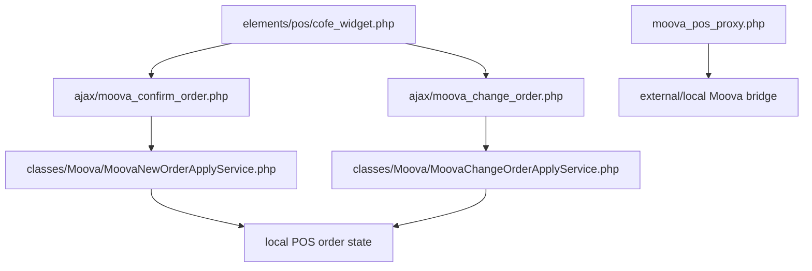
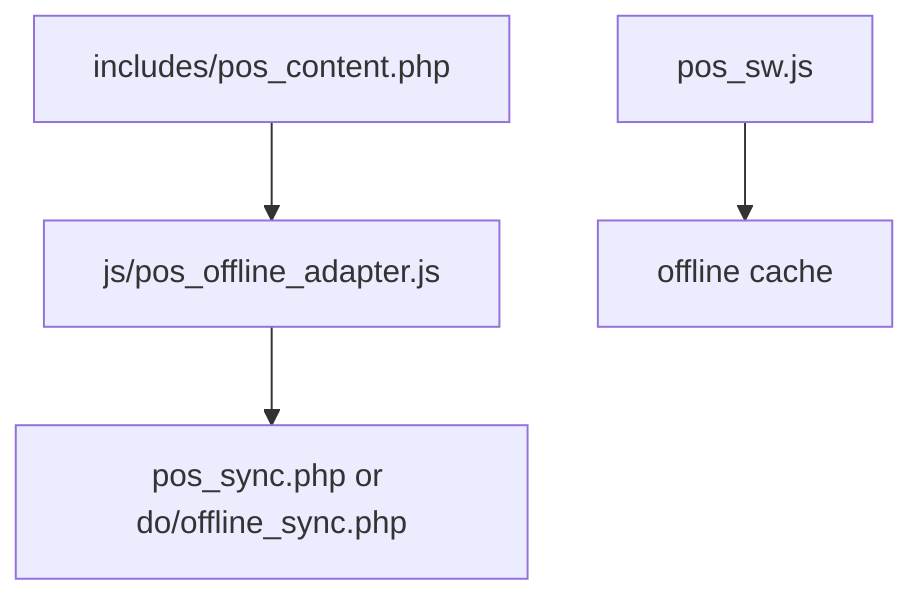

# POSMAIN Phase 0 Active Route Map

Generated: 2026-05-12

## Order Creation Write Surfaces (2026-06)

**Canonical router:** `api/pos/index.php?route=<route>` via [`includes/pos_api_dispatch.php`](../includes/pos_api_dispatch.php).

| Route | Permission | Notes |
|---|---|---|
| `orders.table` | `pos.table.open` | Table save/update |
| `orders.takeaway` | `pos.sell.takeaway` | Paid takeaway create |
| `orders.delivery` | `pos.sell.delivery` | Delivery create |
| `orders.payment` | `pos.payment.take` | Table payment |
| `orders.split-payment` | `pos.split` | Split line payment |
| `orders.edit` | `pos.sell.takeaway` | Takeaway/delivery edit/update |
| `orders.table.free` | `pos.table.open` | Empty held table without active order |
| `integrations.cofe.orders` | `moova.accept` | Cofe HMAC integration |

| Surface | Safety | Notes |
|---|---|---|
| `api/pos/index.php` | **Canonical** | All browser/integration order writes; auth + CSRF + permissions + idempotency |
| `ajax/save_order.php` | Compat shim | Delegates to `orders.table`; denied when `POSMAIN_ORDER_API_ROUTER_ONLY=1` |
| `ajax/process_table_payment.php` | Compat shim | Delegates to `orders.payment` |
| `ajax/process_split_payment.php` | Compat shim | Delegates to `orders.split-payment` |
| `ajax/cofe_create_order.php` | Compat shim | Delegates to `integrations.cofe.orders` |
| `do/doadd_invoice.php` | Legacy compat | Denied when `POSMAIN_ORDER_API_ROUTER_ONLY=1` |
| `do/doadd_invoice_waiter.php` | Waiter shim | Delegates to `do/doadd_invoice.php` |
| `js/pos_order_api.js` | Frontend client | Cashier `submitPOS` posts JSON to API router |
| `classes/PosOrderService.php` | Internal service | Moova table-order compatibility surface |
| `ajax/moova_confirm_order.php` | Integration | Delegates to `MoovaNewOrderApplyService` |
| `ajax/moova_change_order.php` | Integration | Delegates to `MoovaChangeOrderApplyService` |
| `includes/pos_supermarket_content.php` | Browser form | Posts to `do/doadd_invoice.php` (wave 2 cutover) |

**Rollout flag:** `POSMAIN_ORDER_API_ROUTER_ONLY=1` blocks direct legacy write endpoints in production after frontend cutover. Default `0` locally.

**Integration security:** Cofe requires `settings.cofe_integration_secret` + `X-Posmain-Integration-Signature` in production; non-prod allows open integrations only when `POSMAIN_ALLOW_OPEN_INTEGRATIONS=1`.

Cashier `submitPOS` uses `api/pos/index.php` for every supported cashier write. Legacy `do/doadd_invoice.php` form POST is no longer the active owner for takeaway save, edit, table pay, or free-table.

### Cashier action matrix

| Mode | Action | API route | Legacy fallback |
|---|---|---|---|
| Takeaway | `save` | `orders.takeaway` | blocked when router-only |
| Takeaway | `print_receipt` | `orders.takeaway` | blocked when router-only |
| Takeaway | `cash` | `orders.takeaway` | blocked when router-only |
| Takeaway edit | `save` / `cash` / `print_receipt` | `orders.edit` | blocked when router-only |
| Table | `save` / `print_receipt` | `orders.table` | blocked when router-only |
| Table edit | `save` / `print_receipt` | `orders.table` | blocked when router-only |
| Table | `cash` | `orders.payment` | blocked when router-only |
| Table | `free_table` | `orders.table.free` | blocked when router-only |
| Delivery | `save` / `cash` | `orders.delivery` | blocked when router-only |
| Delivery edit | `save` / `cash` | `orders.edit` | blocked when router-only |
| Table | `split_cash` | `orders.split-payment` | blocked when router-only |

Success feedback for API saves uses the Bootstrap modal in `includes/pos_content.php` (`POSShowOrderSuccess`) with no full-page reload. Payment/print actions may still navigate to `print/receipt.php`.

Recovery visibility: `ajax/pos_write_recovery_status.php` reports stale idempotency keys and failed outbox events.

## Main Login And Cashier POS

Notes:

- `pos_barcode.php` and `includes/pos_content.php` both identify `do/doadd_invoice.php` as the cashier form action.
- `do/doadd_invoice.php` is the active owner for the main POS form submit.
- Phase 2 routes new takeaway paid submits (`age=1`, `pro_tybe=9`, cash/bank total greater than zero, not edit mode) through `PosOrderMutationService::createTakeawayOrder`.
- Table writes visible from `tables.php` are owned by the active AJAX endpoints below, not by `do/doadd_invoice.php`.
- Delivery form submits and edit-mode form submits remain documented legacy compatibility branches until a delivery/edit contract is added.
- `do/doadd_invoice.php?debug=1` currently prints raw POST data and must be denied in production.

## Table Orders

Backend ownership:

- `ajax/save_order.php`: table save/add/update owner.
- `ajax/process_table_payment.php`: table payment owner.
- `ajax/process_split_payment.php`: split item/payment owner.
- `ajax/delete_order.php`: POS delete/cancel owner.
- `ajax/clear_table.php`: table clear owner where used.
- `ajax/clear_table_normal.php`: visible tables clear owner.
- `ajax/update_table_status.php`: table occupied/clear status owner.
- `classes/TableOrderService.php`: shared table state and payment helper service.

## Close Shift And Z Close

Backend ownership:

- `close_shift.php`: active close-shift handler.
- `do_close_shift_z.php`: active Z close handler.
- `do/doadd_close.php`: legacy close flow, not the Phase 0 canonical UI owner.

## Moova Widget And Bridge

Backend ownership:

- `ajax/moova_confirm_order.php`: active Moova new-order confirm/apply route.
- `ajax/moova_change_order.php`: active Moova edit/cancel route.
- `classes/MoovaPosIntegration.php`: link table/schema and integration helper.
- `ajax/cofe_create_order.php`: older/direct Cofe creation path; classify as legacy/integration path for later convergence.

## Legacy Offline Prototype

Phase 0 rule:

- In production mode, do not load `js/pos_offline_adapter.js` unless `POSMAIN_ENABLE_LEGACY_OFFLINE_PROTOTYPE=1`.
- Do not rely on browser-only offline as a production substitute for local branch server reliability.

## D-Class Routes To Guard

These routes must be denied when `POSMAIN_PRODUCTION_MODE=1`:

- `pre_start.php`
- `setup_demo_data.php`
- `quick_fix.php`
- `repair_database_jal.php`
- `run_migrations.php`
- `run_payment_updates.php`
- `run_table_updates.php`
- `logs_viewer.php`
- `view_logs.php`
- `ajax/db_setup.php`
- `do/debug_columns.php`
- `do/debug_ot_head.php`
- `do/debug_post.php`
- `do/debug_schema.php`
- `do/debug_schema_2.php`
- `do/dbase/do_turncate.php`
- `do/dobackup.php`

## Phase 0 Route Ownership Summary

| Visible action | Frontend/source | Backend owner | Phase 0 class |
|---|---|---|---|
| Login | `index.php` | `index.php` | A |
| Main cashier sale | `pos_barcode.php`, `includes/pos_content.php` | `do/doadd_invoice.php` | A |
| Table save/add | table/POS UI | `ajax/save_order.php` | A |
| Table payment | `tables.php` | `ajax/process_table_payment.php` | A |
| Split payment | `tables.php` | `ajax/process_split_payment.php` | A |
| Cancel/delete order | `js/pos_barcode.js` | `ajax/delete_order.php` | A |
| Clear table | `tables.php` | `ajax/clear_table_normal.php` and `ajax/clear_table.php` | A |
| Table status update | `tables.php` | `ajax/update_table_status.php` | A |
| Close shift | `includes/pos_content.php` | `close_shift.php` | A |
| Z close | POS close UI | `do_close_shift_z.php` | A |
| Moova new order | `elements/pos/cofe_widget.php` | `ajax/moova_confirm_order.php` | A |
| Moova edit/cancel | `elements/pos/cofe_widget.php` | `ajax/moova_change_order.php` | A |
| Cofe legacy/direct order | widget/integration | `ajax/cofe_create_order.php` | B |
| Legacy offline sync | offline adapter/service worker | `pos_sync.php`, `do/offline_sync.php` | B |
| Setup/debug/repair/log/backup | direct web access | D-class files listed above | D |
